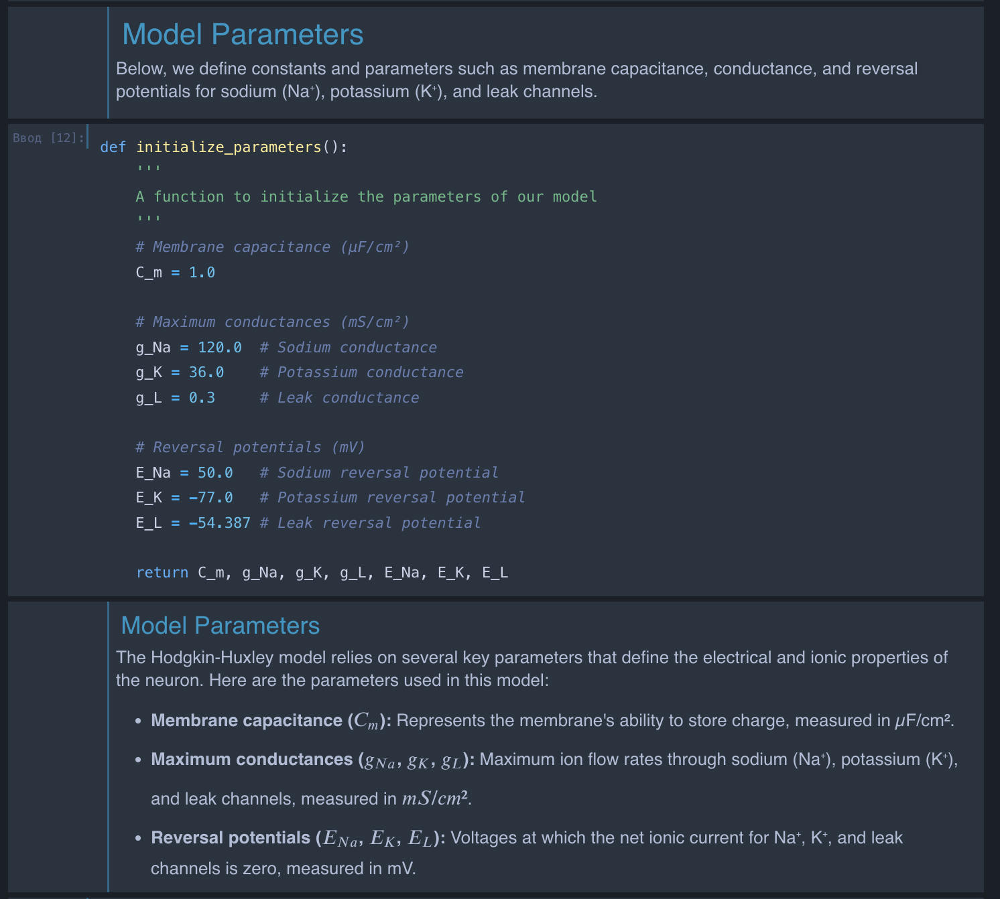
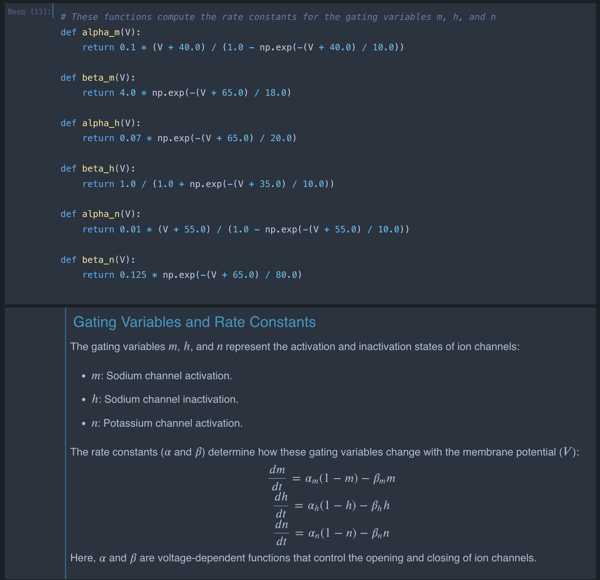
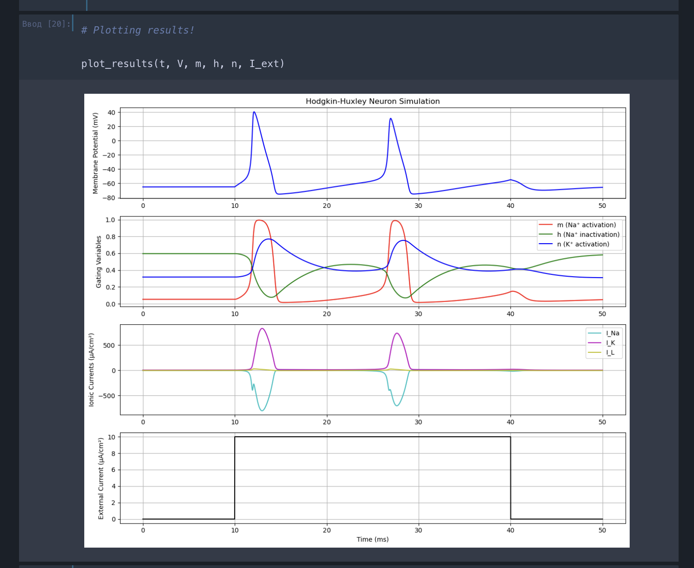
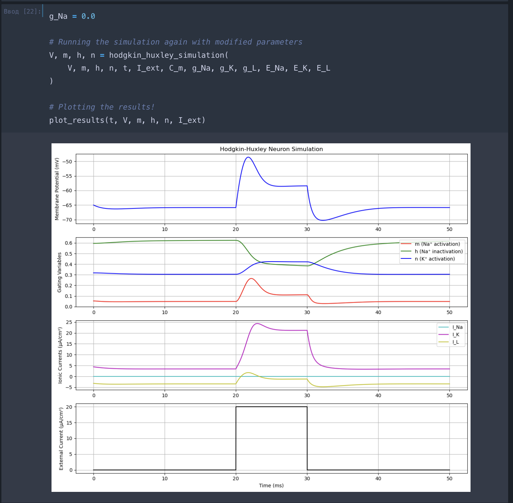
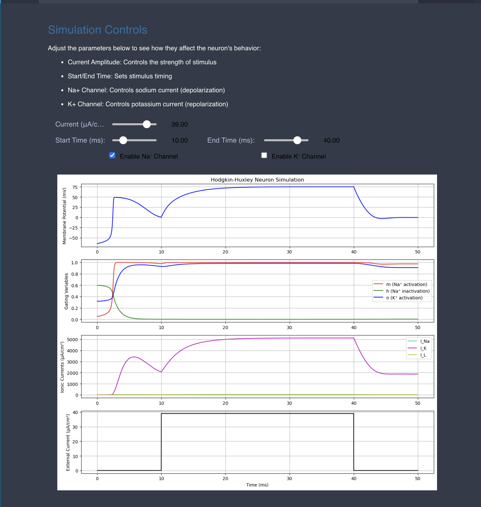

# Hodgkin-Huxley Neuron Simulation

## Overview

This repository contains a Jupyter notebook that implements the Hodgkin-Huxley model to simulate the initiation and propagation of action potentials (spikes) in neurons. The Hodgkin-Huxley model is a mathematical representation that describes how action potentials in neurons are initiated and propagated via ionic currents through the cell membrane. This simulation provides a foundational understanding of neuronal excitability and the biophysical mechanisms underlying nerve impulses.

## Contents

- `Hodgkin_Huxley_Simulation.ipynb`: Jupyter notebook containing the implementation of the Hodgkin-Huxley model and simulations.
- `README.md`: This file provides an overview and instructions.

## Objectives

- **Implement the Hodgkin-Huxley model** using Python and Jupyter Notebook.
- **Simulate neuronal behavior** under different conditions by varying external stimuli and ion channel conductances.
- **Visualize the dynamics** of membrane potential, gating variables, and ionic currents over time.
- **Understand how changes in external current affect neuronal firing** by performing targeted experiments.

## Simulation Details

### 1. Hodgkin-Huxley Model Implementation

The notebook begins with a detailed implementation of the Hodgkin-Huxley model:

- **Constants and Parameters**: Membrane capacitance, maximum conductances, and reversal potentials for sodium (Na⁺), potassium (K⁺), and leak channels.
- **Gating Variables**: Functions for the voltage-dependent rate constants ($\alpha$ and $\beta$) for activation 𝑚, 𝑛, and inactivation ℎ variables.
- **Differential Equations**: Numerical integration using the Euler method to update the membrane potential and gating variables over time.
- **Initial Conditions**: Resting membrane potential and steady-state values for gating variables.

### 2. Baseline Simulation

Under standard conditions, the simulation applies an external current pulse to the neuron and observes its response:

- **External Current**: A current pulse of 10 µA/cm² applied between 10 ms and 40 ms.
- **Membrane Potential Response**: The neuron generates action potentials (spikes) during the stimulus period and returns to resting potential afterward.
- **Visualization**: Plots of membrane potential, gating variables, ionic currents, and external current over time.

### 3. Experiment: Varying External Current

We modified the external current to see how changes in stimulus strength and duration affect neuronal firing patterns.

- **Changes Made**:
  - Increased the external current amplitude from **10 µA/cm²** to **20 µA/cm²**.
  - Shortened the stimulus duration to occur between **20 ms and 30 ms** instead of 10 ms to 40 ms.

 *Results*:
 - **Membrane Potentia**l: The neuron fired action potentials more rapidly during the stronger, shorter stimulus. Spikes occurred between 20 ms and 30 ms, aligning with the new stimulus window.
 - **Firing Rate**: The increased amplitude caused the membrane potential to reach threshold more quickly, resulting in more frequent spikes within the stimulus duration.
- **Gating Variables**: The gating variables 𝑚, ℎ, and 𝑛 exhibited faster dynamics due to the stronger depolarization.
- **Ionic Currents**: Larger amplitude ionic currents were observed, with more pronounced sodium and potassium current peaks during spikes.

By adjusting the amplitude and duration of the external current, we demonstrated how the neuron's firing pattern changes in response to different stimuli. This experiment highlights the neuron's sensitivity to stimulus intensity and timing, emphasizing the importance of external inputs in neural signaling.

### 4. Interactive Simulation

The notebook includes interactive widgets to dynamically adjust simulation parameters. The interactive controls allow users to explore the effects of the following:

- **Current Amplitude**: Adjust the strength of the external stimulus.
- **Start Time and End Time**: Modify the duration of the applied stimulus.
- **Ion Channel Toggles**:
  - Enable/disable the **Na⁺ channel** to control sodium current (depolarization).
  - Enable/disable the **K⁺ channel** to control potassium current (repolarization).
 

